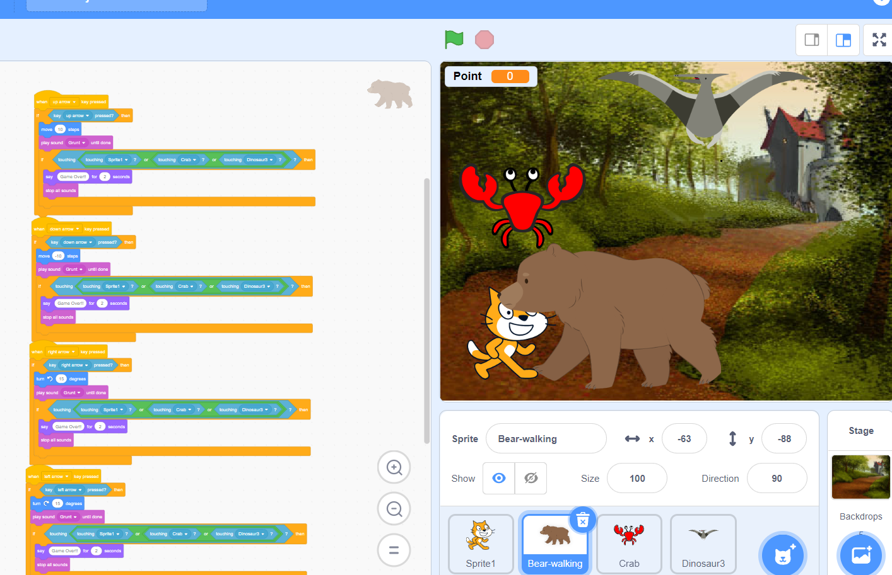

# Treasure Hunt Adventure

**Story:** You are a brave adventurer on a mission to find the legendary Golden Acorn. The Golden Acorn is hidden deep within a mystical forest, and you need to navigate through obstacles and challenges to reach it.

**Gameplay:**

1. The player controls the adventurer, who starts at the entrance of the forest.
2. The player must navigate the adventurer through the forest, avoiding obstacles like rocks, trees, and rivers.
3. Along the way, the player can collect power-ups like health potions, speed boosts, and map fragments to help them on their journey.
4. As the player progresses, the obstacles become more challenging, and the player must use their wits to solve puzzles to reach the Golden Acorn.
5. The final challenge is a boss fight against the forest's guardian, a mischievous creature that tries to protect the Golden Acorn.

