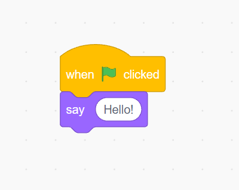
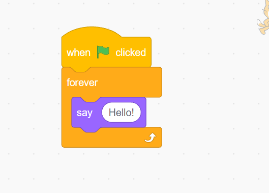
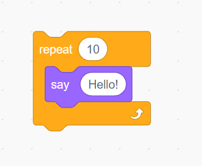
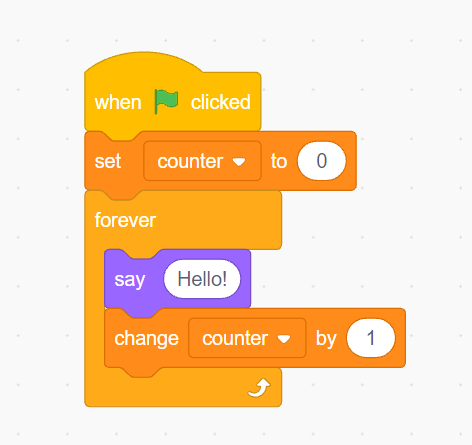
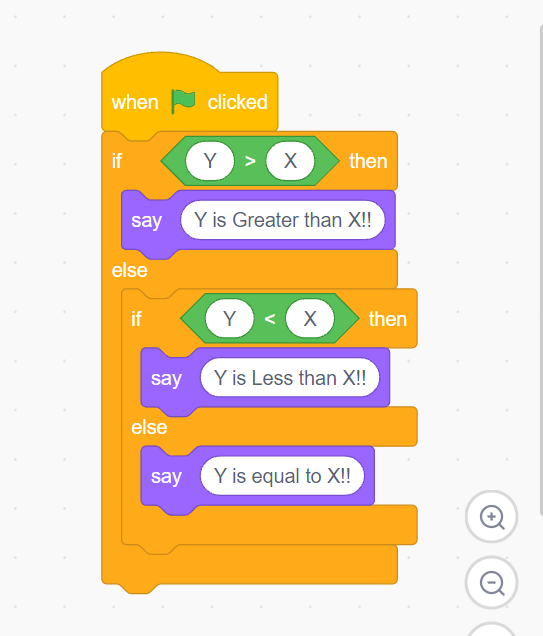

# C Programming
**Note:** Nazu

## (Rev)
- Task: NAZU in Binary

```binary
N   A   Z   U
78  65  90  85

--------

78 in Binary is: 01000110
65 in Binary is: 01000001
90 in Binary is: 01011010
85 in Binary is: 01010101

Therefore NAZU in binary is
01000110 01000001 01011010 01010101 = NAZU
```

## C
- Developed by Dennis Ritchie – AT&T Bell in 1972

For example we have done this in scratch before right?

#### Example 1


which means when green flag is clicked say "Hello".. this is graphical way.. how can we do this in C?
```c
#include <stdio.h>
int main(void){
    printf("Hello \n");
}
```

**Statments:**
well, statments are just `printf("Hello \n");` or in scratch `say "Hello"`
In programming one linse is do something.. these are statments.

**Loops:**
what about loops? well, last week we already talked about it.. right? here is how we do it in scratch

#### Example 2

which is when the green flag is clicked.. forever say "Hello"
in C we do it like this:
```c
#include <stdio.h>
int main(){
    while (1){
        printf("Hello \n");
    }
    return 0;
}
```
#### Example 3

```c
for(int i = 0; i < 10: i++){
    printf("Hello \n");
}
```

#### Example 4



```c
#include <stdio.h>
int main(){
    int counter = 0;
    while (1){
        printf("%d\n", counter);
        counter++;
    }
    return 0;
}
```
and It will continues
Wiat one more

#### Example 5 (Conition)

```c
#include <stdio.h>
int main(){
    if (Y > X){
        printf("Y is greater than X \n");
    }
    else if(Y < X){
        printf("Y is less than X \n");
    }
    else{
        printf("Y is equal to X \n");
    }
    return 0;
}
```

- Compiler (gcc, make)
- float