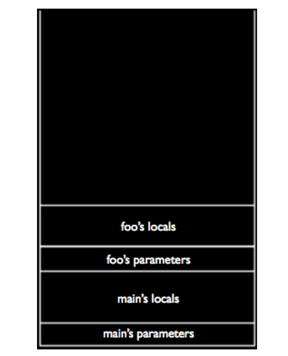
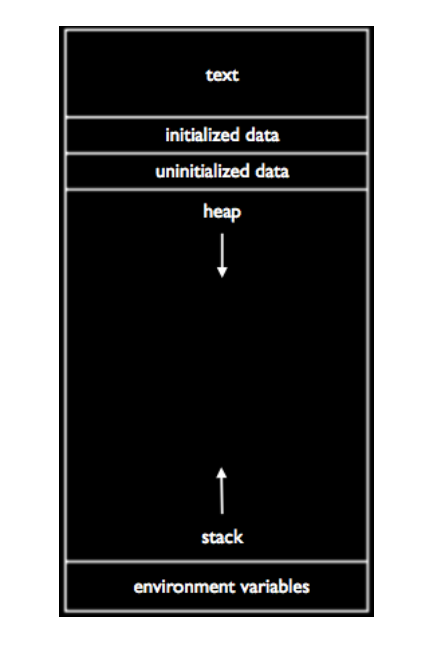
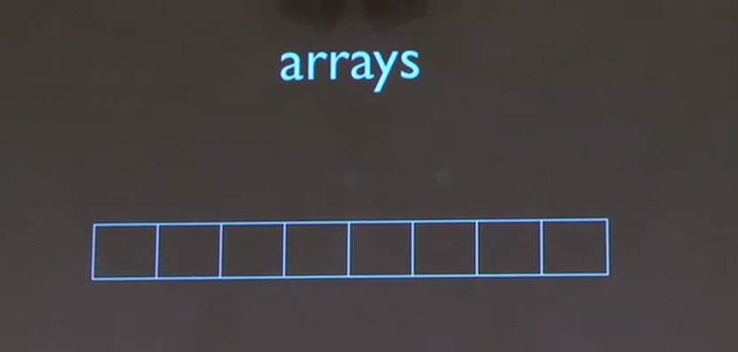

# Scope and the Stack
## buggy3.c
As we mentioned earlier, variables belong to the functions that manipulate them. This is the concept of scope. Variable scope can introduce some subtle bugs, as we’ll soon see in buggy3.c:
```c
/****************************************************************************
 * buggy3.c
 *
 * Computer Science 50
 * David J. Malan
 *
 * Should swap two variables' values, but doesn't!
 * Can you find the bug?
 ***************************************************************************/

#include <stdio.h>


// function prototype
void swap(int a, int b);


int
main(void)
{
    int x = 1;
    int y = 2;

    printf("x is %d\n", x);
    printf("y is %d\n", y);
    printf("Swapping...\n");
    swap(x, y);
    printf("Swapped!\n");
    printf("x is %d\n", x);
    printf("y is %d\n", y);
}


/*
 * Swap arguments' values.
 */

void
swap(int a, int b)
{
    int tmp = a;
    a = b;
    b = tmp;
}
```

Everything looks fine, but when we run the program, we get the following output:
```
x is 1
y is 2
Swapping...
Swapped!
x is 1
y is 2
```

Could it be that we left out the function prototype for swap? No, because the compiler would’ve yelled at us.

Looking at the implementation of swap, it appears correct. We store the value of one variable in a temporary variable, then overwrite its value, then overwrite the other variable’s value with the value stored in the temporary variable. We couldn’t simply write a = b and b = a because we would lose the value of a and both would assume the value of b^3.

It appears that a and b are being properly swapped, but the values aren’t being stored in x and y. What’s really happening when we call swap is that we’re passing in copies of the variables x and y, not the variables themselves. So while swap successfully swaps the values of a and b, it doesn’t actually have any effect on the values of x and y. At the end of swap, before it returns, a has the value 2, b has the value 1, x has the value 1, and y has the value 2. As soon as swap returns, however, a, and b are forgotten and x and y retain their original values. In a few weeks, we’ll be able to fix this problem by using pointers, but for now just assume that functions cannot modify variables that are defined outside their scope.

## The Stack
What’s actually going on in memory when we deal with these variables? Variables are stored in RAM, a temporary kind of memory, as opposed to on the hard disk, a more permanent kind of memory. We can visualize a computer’s RAM like so:



According to this visualization, we can number all of the bytes in a computer’s RAM from 0 to 16 billion or so (assuming your computer has 16 GB of RAM). When we execute a program, then, the variables that belong to main (first its arguments or parameters, then its locals) will be assigned to the lowest numbered bytes in the program’s memory, which appear here at the bottom of this rectangle. When main calls another function, say foo, that function’s variables get stacked on top of main’s in memory.

Interestingly, often when a website is hacked it is by a buffer over run/flow attack, which is just a fancy way of saying that a malicious user provided some input that was too large to be stored properly in one of these inner rectangles and consequently overwrote some of the data in another inner rectangle. As this visualization shows, foo lives separately from main, so it doesn’t (or shouldn’t) have access to main’s variables.

## Global Variables
One way to fix this problem of scope is to use global variables. These variables are unique in that they can be referenced by any function in a program. Take a look at global.c to see how they are used:
```c
/****************************************************************************
 * global.c
 *
 * Computer Science 50
 * David J. Malan
 *
 * Increments variables.
 *
 * Demonstrates use of global variable and issue of scope.
 ***************************************************************************/

#include <stdio.h>


// global variable
int x;

// function prototype
void increment(void);


int
main(void)
{
    printf("x is now %d\n", x);
    printf("Initializing...\n");
    x = 1;
    printf("Initialized!\n");
    printf("x is now %d\n", x);
    printf("Incrementing...\n");
    increment();
    printf("Incremented!\n");
    printf("x is now %d\n", x);
}


/*
 * Increments x.
 */

void
increment(void)
{
    x++;
}
```

We declare the variable x outside the scope of both increment and main, right above the function protoype. This solves our problem in that x can be referenced in any of the functions in this file, but it’s not the cure-all that it might seem. Global variables are generally considered bad style because they’re hard to keep track of. If you’re using code from other libraries, for example, the names of your global variables might inadvertently conflict with the names of library variables and introduce subtle bugs into your program.

## Segmentation Faults
Let’s mess with your minds a little bit by writing a program called bad.c that looks as follows:
```c
#include <stdio.h>

void bad(int n);

int main(void){
    int n = 0;
    bad(n);
}

void bad(int i){
    printf("%d\n", i);
    i++;
    bad(i);
}
```
We could actually call bad’s argument n instead of i, since it’s in a different scope than main.

Why is this program bad? Because bad always calls itself, it will repeat infinitely. Not only that, each time it calls itself, another chunk of memory will be reserved for its variables and parameters, as our visualization of the stack showed. Since our outer rectangle is finitely big, we’ll eventually run out of space for adding inner rectangles. That is, we’ll run out of memory, or worse, we’ll overwrite memory that is being used for other purposes by the operating system. Let’s look at a more complete visualization of a program’s memory:



Notice that the stack grows upward as we call more and more functions, but something called the heap grows downward. As this visualization suggests, the two can potentially collide if one or the other takes up too much space. When we compile and run bad.c, this happens very quickly and we get a message saying that a segmentation fault has occurred. This is the operating system’s safety mechanism which kills a program when it tries to touch memory that doesn’t belong to it. You may have heard of the concept of cracking a program, meaning that the need for an authorization code or a serial number is bypassed so that you can install Microsoft Word or Photoshop without purchasing it. In effect, these cracks are simply touching memory that they don’t own and causing the program to skip past the simple if condition that asks the user to provide an authorization code or serial number.

Before going to the next topic, lets talk about "function prototype"
## What is a function prototype?
A function prototype, also known as a function signature, is a declaration of a function that specifies the function's name, return type, and parameters. It's like a blueprint or a template that outlines the function's interface.

**Real-world example:**

Let's say you're a pizza delivery person, and you want to create a function that calculates the total cost of a pizza order. The function prototype would be:
```c
double calculateTotalCost(int numToppings, double crustSize, double sauceType);
```
This prototype says:

* The function is called `calculateTotalCost`.
* It returns a `double` value (the total cost).
* It takes three parameters: `numToppings` (an `int`), `crustSize` (a `double`), and `sauceType` (a `double`).

**Why is it important?**

Function prototypes are crucial because they:

1. **Specify the function's interface**: They define the function's name, return type, and parameters, making it clear how to use the function.
2. **Enable code reuse**: By defining a function prototype, you can reuse the same function in multiple parts of your program.
3. **Prevent errors**: If you try to call a function without matching its prototype, the compiler will catch the error, preventing bugs and making your code more reliable.

In C, you would typically declare the function prototype at the top of your code file, before the `main` function. For example:
```c
#include <stdio.h>

// Function prototype
double calculateTotalCost(int numToppings, double crustSize, double sauceType);

int main() {
    // Call the function
    double totalCost = calculateTotalCost(3, 14.5, 2.0);
    printf("Total cost: $%.2f\n", totalCost);
    return 0;
}

double calculateTotalCost(int numToppings, double crustSize, double sauceType)
{
    return 0.0;
}
```
In this example, the `calculateTotalCost` function is declared before it's called in the `main` function. This allows the compiler to check the function's parameters and return type, ensuring that the function is used correctly.

# Arrays and Command-line Arguments 
Conceptually, strings are simply collections of char’s, stored one after another in memory. If we were to store “hello” as a string, each character of it would be assigned one byte of memory and an additional byte of memory would be stored at the end. This additional byte is \0, which signifies the end of a string and actually represents a byte whose bits are all 0. Note that there isn’t a \0 after every word you enter, but only after every string you enter, since a string can comprise multiple words and a space can be represented as a char just like any other letter.

```
Box:
           -------------------------
Blocks:    | H | E | L | L | O | \0 |
           -------------------------
```

I drew a box to represent the memory, and inside the box, i have the individual blocks (or characters) that make up the string "hello". The last block is the special "\0" block, which indicates the end of the string.

Another example
```
Box:
           ------------------------------------------------------------
Blocks:    | H | E | L | L | O | \0 | W | O | R | L | D | \0 | ! | \O |
           ------------------------------------------------------------
```
If I type "hello world" this is what happend under the hood! 

So, a string in C is just a new data strcture called an array.



Recall from FruitcraftRPG that Scratch allowed you to store a collection of related variables in what was called a list. This is equivalent to an array in C.

## `argv1.c`
Thus far, we have be defining main as a function that takes no arguments, represented as void. However, we can actually define main as taking arguments which we pass into the program at the command line. We’ve already made use of command-line arguments every time we ran the program make. Running make beer4, for example, passes “beer4” as a command-line argument to make. Let’s see how we might handle these command-line arguments in argv1.c:
```c
/****************************************************************************
 * argv1.c
 *
 * Computer Science 50
 * David J. Malan
 *
 * Prints command-line arguments, one per line.
 *
 * Demonstrates use of argv.
 ***************************************************************************/

#include <stdio.h>


int main(int argc, char *argv[])
{
    // print arguments
    printf("\n");
    for (int i = 0; i < argc; i++)
        printf("%s\n", argv[i]);
    printf("\n");
}
```
So `arg` denotes `argument`
- argc = argument count
- argv = argument vector (synonymous with array)

So when you put a collection of char or strings they end up in a varibale called `argv` and the squre braket is of saying this is an array of arguments. a collection of chars.

argc holds the number of command-line arguments that you passed to the program. By default, the 0th argument is always the name of your program, so argc will always be at least 1.

Recall that we’ve been using string as a shorthand for char *, so we could rewrite the second argument to main as string argv[] if we include the CS50 Library.

argv is a variable that holds the command-line arguments that were passed into the program. The square brackets after argv indicate that it’s an array. In fact, it is an array of strings. In order to access the strings it holds, you can index into it by specifying a number between the square brackets. argv[0], for example, gives the 0th argument which is always the name of the program.

When we compile and run this program, we see that it prints out the command-line arguments we provided it.

## `argv2.c`
argv2.c demonstrates what a string actually is.

When we compile and run argv2.c, we see that it prints out the command-line arguments, one character per line. Programmatically, then, we are iterating not only over the arguments, but over each character in each argument. We can do this because argv is an array of strings and a string is actually an array of characters.

Notice that in the first part of parentheses after the second for, we initialize not just j, but also n. We do this simply by separating them with a comma. strlen returns the length of a string. Because argv is actually an array of strings, we know that argv[i] is a string. Going one level deeper, we can access the jth character in argv[i] like so: argv[i][j]