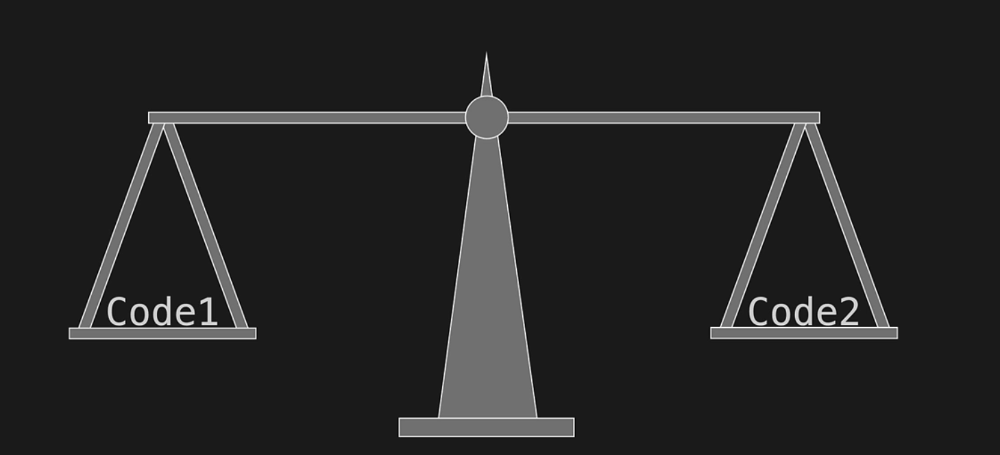
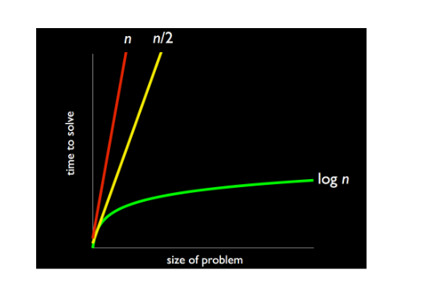

# Week 03
## Big O Notation
Recall from Week 0 the phonebook demo. We learned that successively tearing the phonebook in half was much more efficient than turning page by page in order to find Mike Smith. This is the difference between a logarithmic and a linear approach.



We also looked at an algorithm for counting the number of students in Sanders
1. stand up and think of the number 1
2. pair off with someone standing, add your numbers together, and adopt the sum as your new number
3. one of you should sit down; the other should go back to step 2

Here again, the logarithmic approach, the divide-and-conquer approach, in which half of the students in Sanders sat down on each iteration, proved much faster.

We can visualize this difference in runtime for these algorithms using the following graph:


On the y-axis, we show a generic count of the number of steps it takes to solve a problem. On the x-axis, we show the size of the problem, which we call `n`. n is the number of things we’re counting or sorting or comparing.

Suppose we're trying to solve a sorting problem, where we have `n` (e.g 12) items to sort in a specific order. The size of the problem, n, would be the number of items to be sorted.

```
n (problem size)            Number of steps
10                              5
20                              10
50                              20
100                             40 
```
In the case of finding the tallest person among 4 billion people, n would be 4 billion. 
```
n   Steps
4B    2B
```
As you can see, as n gets larger, the linear approach quickly diverges from the logarithmic approach. Even an approach that takes n/2 steps doesn’t do much better. For example, counting every person in Sanders two at a time rather than one at a time isn’t much faster.

Computer scientists use what’s called `big O notation` to discuss the worst case runtime of algorithms. We would say that the algorithm for counting everyone in Sanders one at a time runs in `O(n)`. What this means is that in the worst case, this algorithm would take **n steps to complete, given n inputs**. The algorithm for counting everyone in Sanders two at a time runs in `O(n/2)` and the algorithm for counting everyone in Sanders using the divide-and-conquer approach runs in `O(log n)`.

O stands for "Order", the order of magitude of running time. So, if we have an algorithm like your grade school counting, 1,2,3,4, we do say that's linear but if you wanna be realy fancy, you can say that algorithm of counting is big O of N. or `O(n)` this means that algorithm in the wors case is going to take you N steps no matter what bc you have to count every person. If we o 2,4,6,8 and so forth, we could actually do someting like O of N over 2 means `O(n/2)` If N is the total number of people divided by 2.

**Well, what does "O(n)", "O(n/2)", and "O(log n)" mean?**

As we know it already, these are called "Big O Notation" and are used to describe how long an `algorithm (a set of instructions)` takes to complete, as the `input size (the amount of data)` grows.

*   **O(n)**: This means that the algorithm's time grows **linearly** with the input size. Imagine you have a toy box with `n` toys inside. If you have to count each toy one by one, it will take you `n` steps to count all the toys. As the number of toys increases, the number of steps it takes to count them also increases linearly.
*   **O(n/2)**: This is similar to O(n), but the algorithm takes half the time to complete. Think of it like counting toys, but instead of counting each toy one by one, you count two toys at a time. It's still a linear process, but it's faster.
*   **O(log n)**: This means that the algorithm's time grows **logarithmically** with the input size. Imagine you have a giant bookshelf with a huge number of books. Instead of searching through all the books one by one, you use a special index to find the book you're looking for quickly. As the number of books increases, the time it takes to find a book using this index grows much slower than linearly.

**What does "algorithm's runtime grows linearly" mean?**

"Linearly" means that the algorithm's time grows at a constant rate, proportional to the input size. Think of it like a straight line: as the input size increases, the algorithm's time increases in a straight line.

*   For example, if an algorithm takes 5 seconds to complete when the input size is 10, it will take 10 seconds when the input size is 20, and 15 seconds when the input size is 30. The time grows linearly with the input size.

**What does "algorithm's runtime grows logarithmically" mean?**

"Logarithmically" means that the algorithm's time grows much slower than linearly. Think of it like a curved line that grows slowly and steadily.

*   For example, if an algorithm takes 5 seconds to complete when the input size is 10, it might take 10 seconds when the input size is 100, and 15 seconds when the input size is 1000. The time grows much slower than linearly, but still grows.

**What is logarithmically?**

Logarithmically means that the rate of growth is slower than linearly. Imagine a staircase: each step represents a certain amount of time. Logarithmic growth is like climbing the staircase, where the time it takes to reach each step grows slower and slower.

## Search
Last time, we talked about arrays as collections of related variables of the same type stored in contiguous memory. To access each element of the array, we used bracket notation. We also observed the dangers of iterating off the end of an array and touching memory that doesn’t belong to us, causing a segmentation fault.

On the board are two arrays of integers covered by pieces of paper. These are meant to simulate how a computer sees them. Whereas we as humans can glance at a series of integers and see all of them at once, a computer can only look at one integer at a time. Hence the pieces of paper covering the integers.

Let’s watch Sean as he tries to find the value 7 in the top array. Having no foreknowledge of the array, he looks behind pieces of paper moving left to right and finds that 7 is the last number in the row. Of course, this process isn’t very efficient. In the worst case, for an array of length n, the very last number we examine will be the one we are searching for, so we’ll have to walk through n steps to find it. With no foreknowledge of the array, this is the best we can do: to brute force examine every single element of the array. Looking under the pieces of paper two at a time is a marginal improvement, but with a large enough n, this improvement is negligible.

Note that in the best case, the number we’re searching for will be the first one we examine, so the algorithm only takes 1 step. We denote this as `Ω(1)`, where omega refers to the best-case scenario runtime.

Now let’s ask Jeremy to search the bottom array for the number 50, this time knowing that the array is sorted in ascending order from left to right but still not knowing what numbers it contains. Jeremy jumps to the middle of the array and finds the number 61. Now we can disregard the right half of the array since our number is less than 61 and the array is sorted. With the remaining left half of the array, Jeremy again chooses a number in the middle and finds 50. Success! In this case, Jeremy found the number in 2 steps, but even in the worst case, it would only have taken 1 more step for a total of 3. Compare that to the 8 steps that Sean took.

Dealing with a sorted array and using binary search, we were able to greatly reduce the number of steps it took to find a specific number. But how do we sort an array?

So, Big `O(n)` for the worst case and then Omega `Ω(1)` for the best case. And maybe it could take him 2 steps.

## Sort (Selection Sort)
Realize that when it comes time to implement search and sort algorithms, there might not be an exact middle to the array or list of items. You’ll need to make sure to round up or down after you divide the number of items in the array or list by two.

For this demonstration, we ask 8 volunteers to come on stage and hold pieces of paper with the numbers 1 through 8 in a somewhat jumbled order. If we were to represent these 8 numbers in a computer program, we’d probably use an array rather than 8 separate variables. As a result, the computer itself can’t see the values of all the variables at the same time. This is an important consideration for us as we design our sorting algorithms.

Casey is our volunteer who will be sorting the other volunteers on stage. In her first attempt, she places the number 1 in the first position of the array, and shifts the other numbers down. Then she places the number 2 in the second position of the array, and shifts the other numbers down. And so on. How many steps does this take to sort the entire array of 8? Although it would seem that it took only 8 steps, one for each number that was placed in its correct position, this estimate glosses over the additional steps that were required to find the next smallest number and to shift the other numbers down the array each time a number was placed in its correct position.

One optimization we can make is instead of shifting the other numbers down the array, simply swap the next smallest number with the number that is in its correct position. So, in the first case, we swap the number that’s in index 0 of the array with the number 1. This only requires 1 step rather than the several it takes to shift numbers down the array. this takes `O(n2)` I guess lol

On the first iteration of our sorting algorithm, it actually took us `n` steps to find the smallest number since we have to traverse the entire array. On the second iteration of our sorting algorithm, however, we already know that index 0 correctly contains the smallest number, so we can skip it when looking for the next smallest number. Thus, searching for the smallest number takes `n` steps on the first iteration, `n − 1` on the second iteration, and so on. In addition to these searching steps, there is a swap step on each iteration of the algorithm, but we can ignore this as negligible when calculating big O notation for this algorithm. Our whole algorithm then takes `n + n − 1 + n − 2 + n − 3`. . . which, if you remember some high school math, simplifies to `n(n + 1)/2`. In short, this algorithm takes about `n2` steps, so we say that it is in `O(n2)`. Formally, this algorithm is called selection sort.

## Bubble Sort
Our second sorting algorithm involves starting at the beginning of the array and examining the first two numbers. If the left number is greater than the right number, we know intuitively that they are out of place, so we swap them. Then we iterate to the next two numbers and compare them in the same way.

What’s the worst-case scenario for this algorithm? If the array is in reverse order, it will take the maximum number of steps to sort using this algorithm. If the number 8 is at index 0, it takes 7 swaps to move it to its correct position on the first iteration of the algorithm. On the second iteration of the algorithm, it takes 6 swaps to move the number 7 from index 1 to its correct position. And so on. Looks like in the worst case, this algorithm also takes `n + n − 1 + n − 2 + n − 3`. . . steps, so we’re back at `O(n2)`. Because of the way numbers bubble up from one end of the array to the other, this algorithm is called bubble sort.

## Omega / Ω
We’ve talked about the worst-case runtimes for selection sort and bubble sort, but what about their best-case runtimes? In the world of sorting, the best case is certainly that the array is already sorted

As it turns out, selection sort runs in n2 even in the best-case scenario. Remember that the computer doesn’t know at the time it sees 1 in index 0 of a sorted array that 1 is the smallest number in the array. It still has to traverse the entire array to make sure. Likewise with the second iteration, it still takes n − 1 steps to find the smallest number. And so on. Bummer, selection sort is in Ω(n2).

With a certain optimization, bubble sort can be in Ω(n). If the array is already sorted and we iterate through every element of it on the first iteration, we won’t need to make any swaps at all. If we made no swaps on the first iteration, then there’s no need for a second iteration, since it too will make no swaps. Thus, assuming we check if any swaps were made, we need only one iteration of the algorithm in the best-case scenario. This means n steps.

Overll, here are brief explanations for each concept:

* **Big O**: Describes the time complexity of an algorithm, how long it takes to complete as input size grows.
* **Linear search**: Searches for an element in a list by checking each element one by one.
* **Binary search**: Searches for an element in a sorted list by dividing the list in half and repeating the process until the element is found.
* **Asymptotic notation**: Used to describe the time complexity of an algorithm, usually represented as O(1), O(log n), O(n), O(n log n), etc.
* **Recursion**: A programming technique where a function calls itself repeatedly until it reaches a base case.
* **Bubble sort**: A simple sorting algorithm that repeatedly steps through the list, compares adjacent elements, and swaps them if they are in the wrong order.
* **Selection sort**: A simple sorting algorithm that repeatedly finds the minimum element from the unsorted part of the list and moves it to the beginning of the sorted part.