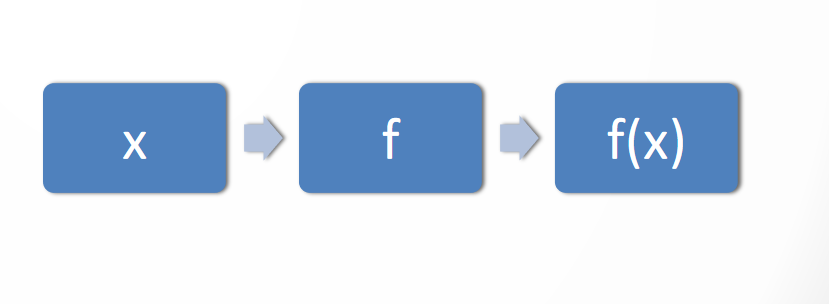
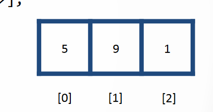
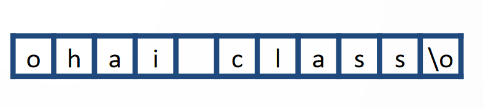
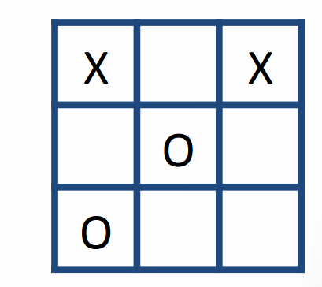
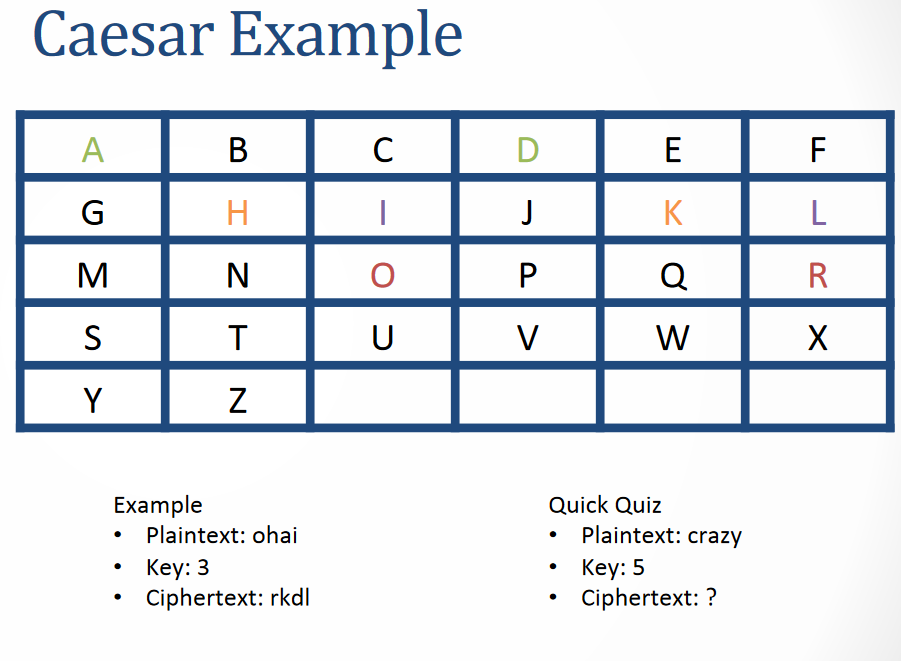
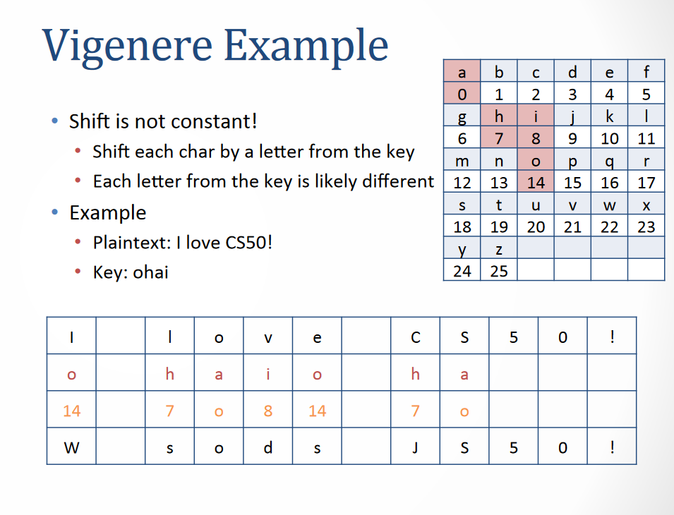

# Section 2, Week 2
Sections (otherwise known as "recitations" or "precepts" at other universities) supplement lectures. Led by Jason Hirshhorn.

## Functions

- Take things in (parameters)
- Do something to them
- Spit them out (return value)



## Scope
- Every variable has a certain scope. Where the variable can be referenced
- Global vs. local
- What happens in the curly braces, stays in the curly braces!
- Hiding

## Command Line Arguments
How can we pass informa8on to our program?
From now on: `int main(int argc, char *argv[])`
- argc means "Argument count" # of arguments passed to the program.

- argv[] means "Argument vector" One-­dimensional array of strings (each string is one of the arguments

`./code hey nazu`
- Argc = 3
- Argv[0] = "code";
- Argv[1] = "hey";
- Argv[2] = "nazu";

## Arrays
Array is simply a Data structure to hold multple values of the same type.
- All the same
- Right next to each other
- Sequen8ally numbered


### Coding Arrays
- create an array
> `<data type> <name>[<size>]`
- Access a location
> `<name>[<array index>];`
- Example 
```c
int mailbox[3];
mailbox[0] = 5;
mailbox[1] = 9;
mailbox[2] = 1;
```

- Alternatvely
> `int mailbox[3] = {5, 9, 1};`
- Arrays are 0-­indexed
> The number in brackets refers to the offset from the first spot.

### Iterating Through Arrays
```c
#include <stdio.h>

int main(){
    char class[3] = {"nazu", "nazi", "sam"};

    for(int i = 0; i <=3; i++){
        printf("%d\n", class[i]);
    }
}
```
Where’s the bug? `<=3` should be `2`!

## Strings
String is just An array of chars!
And it happen When itera8ng through a string.
It Uses the null character ('\0') to end.


Quiz:
- Find the problem: `char foo[3] = "bar";`
```
__________
|b|a|r|\0|
----------
```
Index:
```
b=0
a=1
r=2
\0=3
```
we have to make it `foo[4]`

## Multi-­‐dimensional Arrays
When you want your array to have rows and columns, you will do arrays of arrays.
```c
#include <stdio.h>

int main() {
    char tictactoe[3][3];
    tictactoe[0][0] = 'X';
    tictactoe[0][2] = 'X';
    tictactoe[1][1] = 'O';
    tictactoe[2][0] = 'O';

    for (int i = 0; i < 3; i++) {
        for (int j = 0; j < 3; j++) {
            printf("%c ", tictactoe[i][j]);
        }
        printf("\n");
    }
    return 0;
}
```


# Problem Set Info
## Magic Numbers
Magic num is simpliy a number not litral number!!
```c
#include <stdio.h>
#define QUARTER 25

int main(){
    int coins = 0;
    int change;
    scanf("%d", &change);
    coins += change / QUARTER;
    printf(coins);
    return 0;
}
```

# Problem Set 2
## `Oldman.c`
Cryptography
- `Caesar.c`



- `Vigenere.c`


Terms
- Plaintext – the text you’re going to encrypt
> "Sam"
- Key – used to encrypt the plaintext
- Ciphertext – the encrypted text

If we have 97 and we are shifting 3 becomes 100
Let's go through the Caesar cipher example step by step.

### Plaintext: 
- "Sam"

### Key: 
Shift each letter 3 positions forward in the alphabet.

### Encryption:
- S (97) -> W (100)
- A (65) -> D (68)
- M (77) -> O (79)

### Ciphertext: 
- "WDO"

So, the encrypted text is "WDO".


Plaintext: 
- "Crazy"

Key: 
- 5

Ciphertext: 
- Hwfed

# Practice Problem
Print out as many numbers in the Fibonacci sequence as the user requests at the command line

Example:
```
./fibonacci 10
0, 1, 1, 2, 3, 5, 8, 13, 21, 34
```

Requirements:
- User input must be one and only one positve integer
- Use a helper functon that takes an integer (the user’s input) and an integer array (to store the sequence)