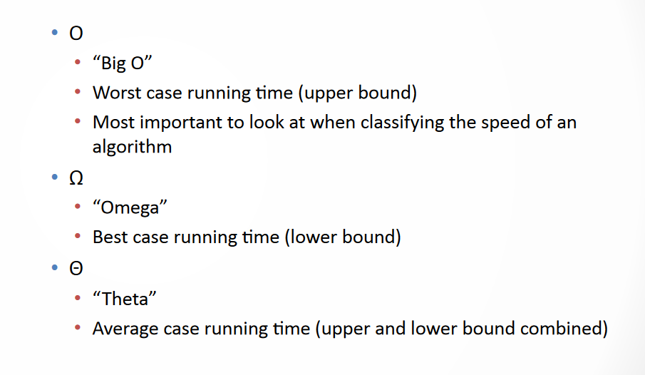
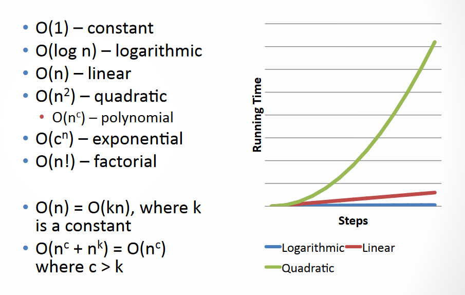
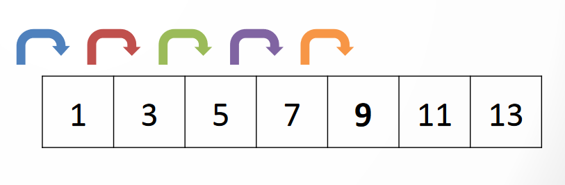
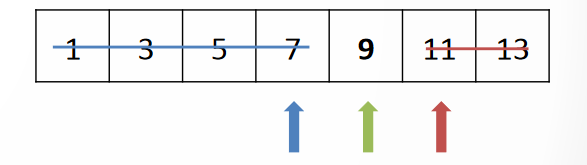
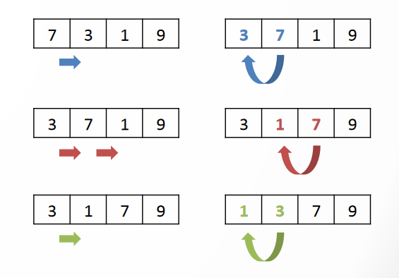
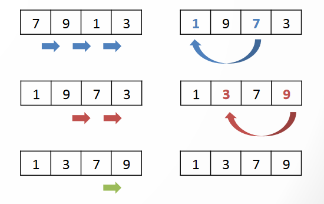
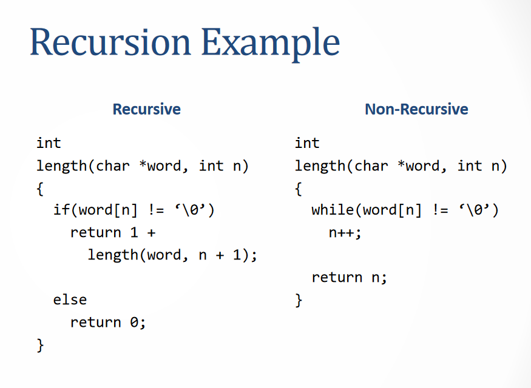
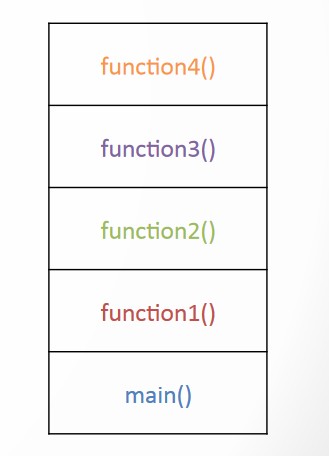

# Secttion: Week 03
Check for invalid inputs
```c
if(argc != 2)
{
    printf(“Enter a key.\n”);
    return 1;
}
```

Check for corner cases
- Zero
- Negatives
- Characters instead of numbers

## pset1 ‐ Design
- Problems have many right answers but only a few good ones

So, develop a problem‐solving strategY
- Focus on one task at a Fme
- Solve the problem in English (Or what we call a pesudo code)
- Write the pseudo‐code
- Translate it into C
- Try it
- Repeat for the next task

## Asymptotic Notation




## Linear Search
Iterate through each element in a list untill we find the one we want (List may or may not be sorted)

Big O: `O(n)`, `Ω(1)`



## Binary Search
must have sorted list and Start in the middle. If this is the right number, then all done. Else if too high, Divide in half, Ignore right half and repeat on left half. Else if too low, divide in half, ignore left half and repeat on the right half.



Big O: O(log n), Ω(1)

## Bubble Sort
If adjacent elements are out of place, swap them and Keep going through the list untill no swaps are made. Big O: O(n2), Ω(n).



## Selection Sort

Find the smallest element and swap it with the first element, Find the next smallest element and swap it with the second element then Repeat unFl the end of the list. Big O O(n2), Ω(n2).



## Recursion
Is A funcFon that calls itself. And Base case is when the funcFon should stop calling itself, Stops the funcFon from calling itself forever. and Recursive call is When the funcFon calls itself again.

Recursion and Non‐Recursive Example:


## Call Stack
Every function gets its own space in memory ("frame") So, when a funcFon is called, it creates a new frame. and these Frames stack on top of each other. Top frame = acFve frame. and Afer it finishes it disappears then The frame below it becomes active.




**Well, Why does Linear Search have a Big O of O(n)?**

Linear Search, or iterating through each element in a list until we find the one we want, has a Big O of O(n) because:

1. **In the best-case scenario**, the element we're searching for is at the beginning of the list. In this case, we only need to check one element, so the time complexity is O(1).
2. **In the average-case scenario**, the element we're searching for is somewhere in the middle of the list. In this case, we need to check approximately half of the elements, so the time complexity is O(n/2).
3. **In the worst-case scenario**, the element we're searching for is at the end of the list. In this case, we need to check all n elements, so the time complexity is O(n).

Since the worst-case scenario is the most common and has the highest time complexity, we use the Big O notation to describe the algorithm's time complexity as O(n). This means that as the input size (n) grows, the time it takes to complete the algorithm grows linearly.

**Why does Linear Search have a Big Ω(1) as well?**

Big Ω(1) is the "lower bound" of the algorithm's time complexity. It means that even in the best-case scenario, the algorithm takes at least O(1) time to complete. In other words, it's the minimum time it takes to complete the algorithm.

In the case of Linear Search, the best-case scenario is when the element we're searching for is at the beginning of the list. In this case, we only need to check one element, so the time complexity is indeed O(1).

So, to summarize:

* Big O(n) represents the worst-case time complexity of Linear Search, which is linear in the size of the input.
* Big Ω(1) represents the best-case time complexity of Linear Search, which is constant (O(1)).

This is Week 3