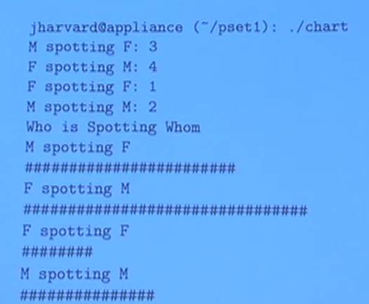

# Write a Program
- use code editor to create `hello.c`
- make hello
- ./hello

# Code style is very very important!!

# Input
- user input (and validation)
- keep track of how much money we have
- double our money the right of times
- output money

## Pesudocode
get number of days in month
get number of pennies on the first day
while (days left in month)
    if (not the first day of the month)
        double pennies
        decrement days left in month
output dollars and cents

# Chart

- Chart width is max 80 characters
- width of bard based on proportion, not total sighthings
    - 3 M spotting F is not 3 # on the chart
    - round DOWN when calc total number of #

**Examples:**
- total sightings = 3 + 4 + 1 + 2 = 10
    - M spotting F = 3/10 = 30%
    - F spotting M = 4/10 = 40%
    - F spotting F = 1/10 = 10%
    - M spotting M = 2/10 = 20%

- Max width is 80 char
    - M spotting F = 0.3 * 80 = 24
    - F spotting M = 0.4 * 80 = 32
    - F spotting F = 0.1 * 80 = 8
    - M spotting M = 0.2 * 80 = 16

