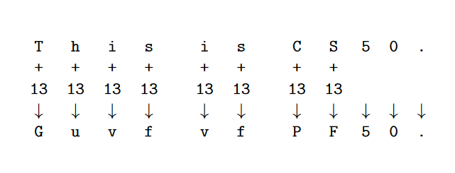

# Problem Set 2_ Crypto
## "oldman.c"
So the first problem on this problem set is called "oldman", So what we need to do here is produce the output like this:
```bash
./oldman
This old man, he played one
He played knick-knack on my thumb
Knick-knack paddywhack, give your dog a bone
This old man came rolling home
```
basically outputting the song. So our to do list here isn't too bad. So we basically need to do two things: 
- Loop over verses  
- Display each verse 

10 verses, each slightly different and we can store verses in variables. or we can use conditions for different text is displayed depending on verse number. we can also use arrays.

function: block of code aimed at accomplishing a single task. 
- I take input, produce output

task: display a verse
- input: which verse to display
- output: text of verse

## caesar.c
```bash
./caesar 13
This is CS50.
Guvf vf PF50.
```

1. get k from command line and convert to int
2. prompt for string to encode
3. loop over each character of the string
4. output each encoded letter, making sure to not encode non-letters

**Getting Input**
- argc: number of arguments given
- argv[]: array of strings
- ./caesar 13
    - argc == 2
    - argv[0] == "caesar"
    - argv[1] == "13"

**atoi**
- converts a string to an integer
```c
string a = "50";
int i = atoi(a);
```

**Strings**
- char: singel character, type just like `int` or `float`
- strings are just char arrays
    - strlen: get length of string
```c
string word;
scanf(%char, word);
int lengeth = strlen(word);
for (int i = 0; i < lenget; i++)
    printf("%c", word[i]);
```

**Caesar Cipher**
`ci = (pi + k) % 26`
- ci : ith character in the ciphertext
- pi : ith character in the cleartext
- k: number of rotations (user’s input)
- % 26: Z should wrap to A
http://en.wikipedia.org/wiki/Caesar_cipher



**ASCII**
http://www.asciitable.com/
- ASCII maps characters to numbers
    - ’A’ = 65
    - ’a’ = 97

