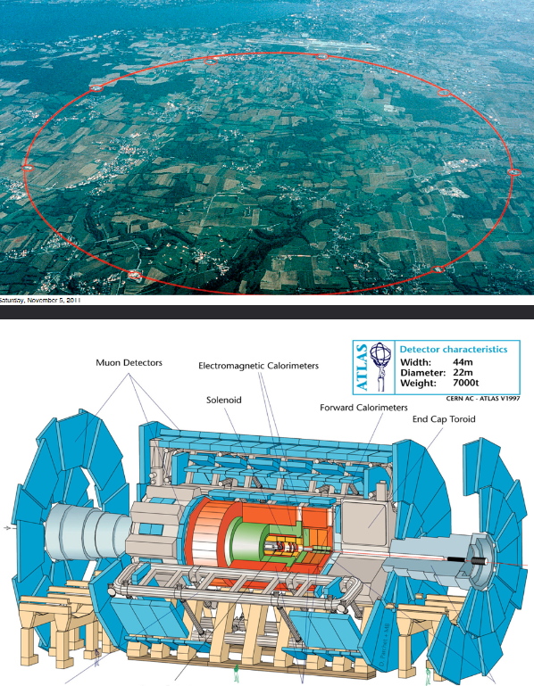

# Accelerating Science with the Open Science Grid
In the mid-1990s, the high-energy physics community (think FermiLab and CERN) started planning for the Large Hadron Collider. 

Managing the petabytes of data that would be generated by the facility and sharing it with the globally distributed community of over 10,000 researchers would be a major infrastructure and technology problem. 

This same community that brought us the web has now developed standards, software, and infrastructure for grid computing. In this seminar He'll present some of the exciting science that is being done on the Open Science Grid, the US national cyberinfrastructure linking 60 institutions (Harvard included) into a massive distributed computing and data processing system.

