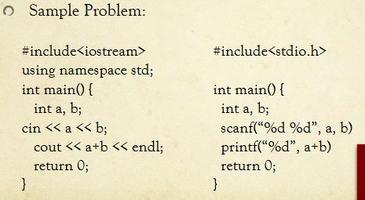

# Acing Your Technical Interview
## How do they hire?
- Interview
    - Software Engineer
- Require Technical Background

> Check if a number is a power of 2. In an array of size n-1 with all but one number from 1-n, find the missing number. Make the pow function

## Why do they interview?
- Acquire the best talent for their company
    - Software Engineers – Code!
- The interview process then must be difficult and very selective.

> Given a linked list, extend the linked list with the current elements reversed. Reverse the linked list. Randomize the linked list.

## The Interview
- Series of 2 to 5 depending on the company
- 30-40 minutes each
- Two types:
    - Onsite : whiteboard coding
    - Over the Phone : Collab-edit coding
- 2-3 problems testing your computer science knowledge (probably DSA)

> Write Binary Search, Traverse a Tree recursively. Given traversals (pre, in, post) determine the tree

## Types of Questions
- Problem Solving / Algorithms
    - Find optimal solutions (Big-O)
    - Write the solution

- Data Structures
    - Goes along with algorithms but they might directly as you questions about this

- The internet
    - Information flow
    - Web development techniques

- Designing
    - Database
    - Systems (Classes, modules, etc.)

> Write Fibonacci recursively, iteratively. What are the differences?

## General Tips
- Know your recruits, don’t be late, dress nicely
- Don’t stop talking!
    - Fast responses 
- Think out loud
- They want to see your code (even if it’s pseudocode!)
- Ask for hints
    - They’re nice people!

> Create a deck of cards. Then implement shuffle.

## Data Structures
- Stacks
- Queues
- Linked-Lists
- Maps / Sets
- Hashtables
- Binary Trees / Trees
- Tries
- Red-Black Trees
- AVL Trees
- Graphs
- Heaps

> Implement and give the Big-O for all data stuctures

## Algorithms
- Search
- Recursion
- String Manipulations
- Number Manipulations
- Flood Fill
- Shortest Path
- Greedy
- Network Flow
- Dynamic Programming
- Ad Hoc Problems
- CS124

> Design an iterator for your data structures. Implement insert and delete as well.

## Preparation
- Problem solving. Competitive coding problems.
- Do problems as if you are in an interview
- Quiz your friends

e.g leetcode.com
1. glassdoor.com, Google
2. poj.org
3. projecteuler.net
4. train.usaco.org
5. topcoder.com
6. codeforces.com

> Implement Merge Sort. Implement a Priority Queue.

## glassdoor.com
- People talk about their past interview experiences with companies.
- Nowhere to turn in code
- People’s solutions are mostly wrong or incomplete

...

## Competitive Programming
- File I/O. Scan file in. Print file out.
- 

