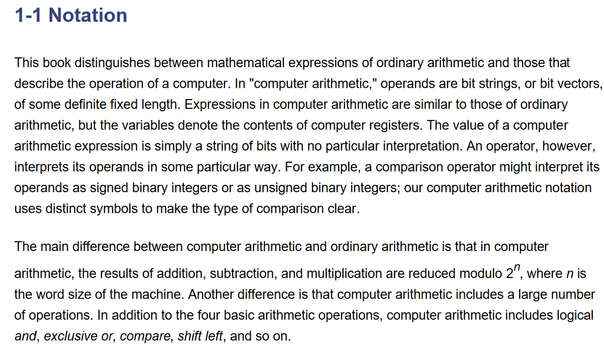

# Intro

When we perform arithmetic operations (addition, subtraction, and multiplication) on computer numbers, we're working with binary numbers, which are represented as strings of 0s and 1s. These numbers are typically stored in a computer's memory using a fixed number of bits, known as the word size.

The "modulo 2n" operation is a way of reducing the results of these arithmetic operations to a smaller range. In other words, it's a way of wrapping around to a smaller set of values.

Here's how it works:

* When performing arithmetic operations, the computer calculates the result as usual.
* However, instead of returning the full result, the computer reduces it modulo 2n, where n is the word size of the machine.
* This means that the result is taken modulo 2n, which effectively wraps around to a smaller range.

For example, if we're working with 8-bit numbers (a common word size for many computers), the modulo 2n operation would wrap around to a range of 0 to 255 (since 2^8 = 256).

When reducing a result modulo 2n, any value greater than or equal to 2n is wrapped around to a smaller value. For example:

* If the result is 256 (0x100), it would be wrapped around to 0 (0x00)
* If the result is 257 (0x101), it would be wrapped around to 1 (0x01)
* If the result is 258 (0x102), it would be wrapped around to 2 (0x02) and so on

This wrapping around is what allows the computer to represent a large range of values using a fixed number of bits. It's a fundamental concept in computer arithmetic and is used extensively in many areas of computer science, including cryptography, coding theory, and digital signal processing.

