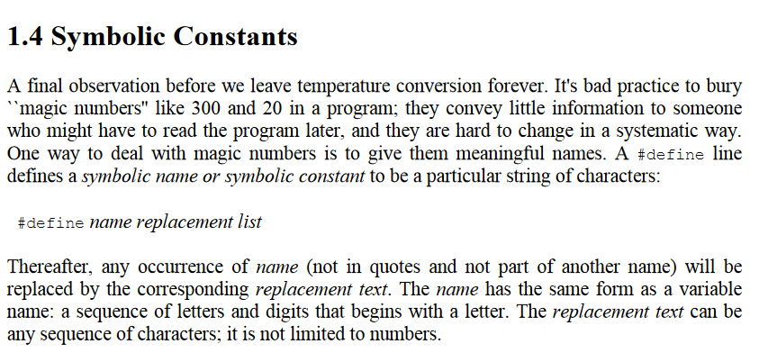

# C Programming Language 2nd
## `#define` in C



In C, `#define` is a preprocessor directive that allows you to define a macro, which is a sequence of tokens that can be replaced with a specified value or expression. The `#define` directive is used to define a macro, and the replacement list is the sequence of tokens that will replace the macro.

Here is an example:
```c
#define PI 3.14
```
In this example, `PI` is a macro that will be replaced with the value `3.14` whenever it is encountered in the code.

**Replacement List**

The replacement list is the sequence of tokens that will replace the macro. It can be a simple value, an expression, or even a more complex construct, such as a function call.

For example:
```c
#define SQUARE(x) ((x) * (x))
```
In this example, the macro `SQUARE` takes an argument `x` and replaces it with the expression `((x) * (x))`, which calculates the square of `x`.

**Comparison to Const Variables in JavaScript**

In JavaScript, `const` variables are used to declare constants, which are immutable values that cannot be changed once they are assigned.

While `#define` in C and `const` in JavaScript both allow you to define constants, they serve different purposes and have different semantics.

* `#define` in C is a preprocessor directive that allows you to define a macro, which is a sequence of tokens that can be replaced with a specified value or expression.
* `const` in JavaScript is a keyword that allows you to declare a constant variable, which is an immutable value that cannot be changed once it is assigned.

Here are some key differences:

* `#define` is evaluated at compile-time, while `const` is evaluated at runtime.
* `#define` allows you to define a macro with a replacement list, while `const` allows you to declare a constant variable with a value.
* `#define` is used to define a constant value or expression, while `const` is used to declare a constant variable.

In summary, while both `#define` in C and `const` in JavaScript allow you to define constants, they serve different purposes and have different semantics.